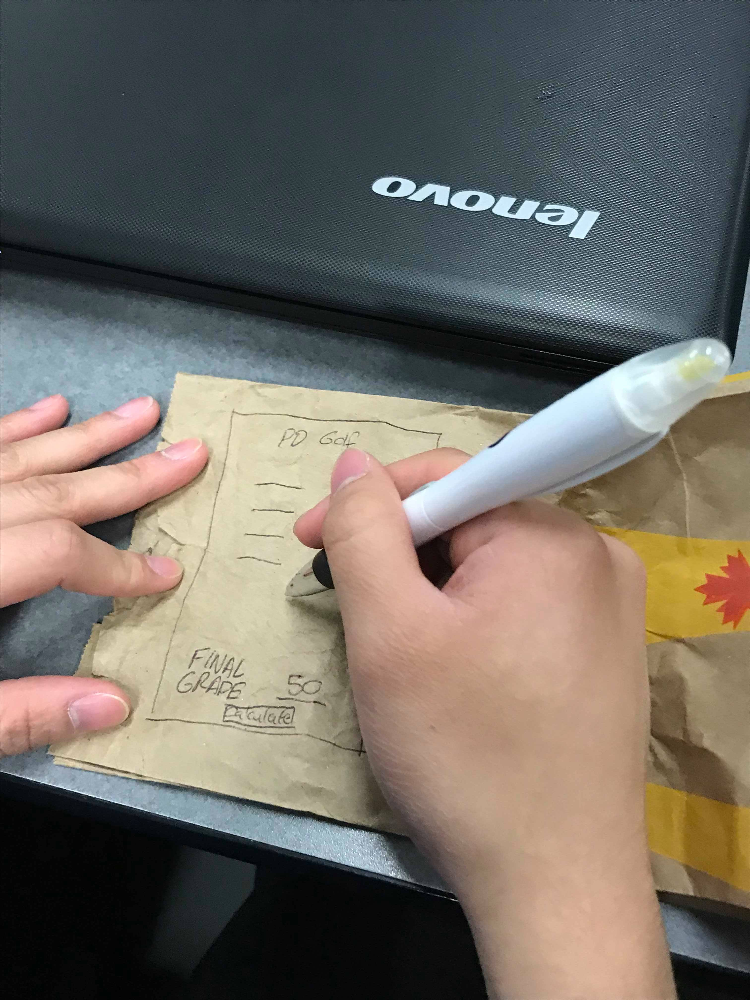

# pd-golf

A web app that caculates the minimum mark needed in assignments to pass PD, using inputted information on assignments, weights, and grades.

<figure>
  
  <figcaption>Fig.1 Back of the envelope sketch</figcaption>
</figure>
